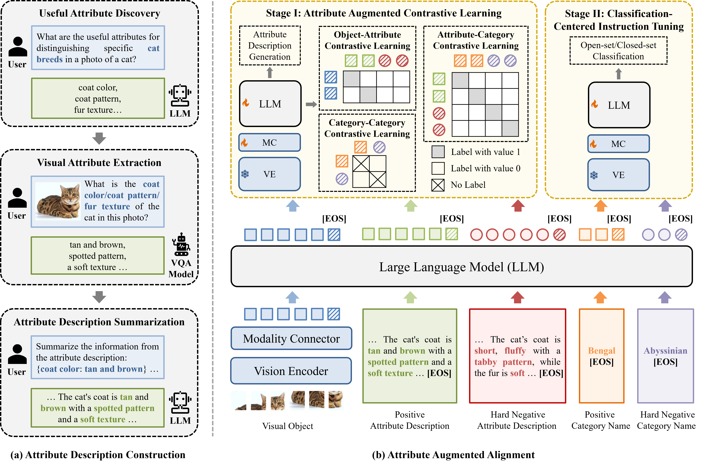

<!-- PROJECT LOGO -->

<p align="center">
  <h1 align="center">Analyzing and Boosting the Power of Fine-Grained Visual Recognition for Multi-modal Large Language Models</h1>
  <p align="center">
    <a href="http://39.108.48.32/mipl/news/news.php?id=EGhehulingxiao"><strong>Hulingxiao He</strong></a>
    ·
    <a href="http://39.108.48.32/mipl/news/news.php?id=EGligeng"><strong>Geng Li</strong></a>
    ·
    <a href="http://39.108.48.32/mipl/news/news.php?id=EGgengzijun"><strong>Zijun Geng</strong></a>
    ·
    <a href="https://github.com/xujinglin"><strong>Jinglin Xu</strong></a>
    ·
    <a href="http://39.108.48.32/mipl/yuxinpeng/"><strong>Yuxin Peng</strong></a>
  </p>
  <h2 align="center">ICLR 2025</h2>
  <h3 align="center"><a href="https://arxiv.org/abs/2501.15140">Paper</a> | <a href="https://huggingface.co/StevenHH2000/Finedefics">Model</a> | <a href="https://iclr.cc/media/PosterPDFs/ICLR%202025/28323.png?t=1744547699.8079863">Poster</a> | <a href="https://iclr.cc/media/iclr-2025/Slides/28323_8XlLqgr.pdf">Slides</a> | <a href="https://iclr.cc/virtual/2025/poster/28323">Video</a></h3>
<div align="center"></div>
<p align="center">
  <p>
  <strong>TL;DR</strong>: We revisit three quintessential capabilities of MLLMs for FGVR, including object information extraction, category knowledge reserve, object-category alignment, and position of the root cause as <strong> a misalignment problem</strong>. To address this issue, we present <strong> Finedefics</strong>, an MLLM that enhances the model's FGVR capability by incorporating informative attribute descriptions of objects into the training phase. 
  </p>
  <a href="">
    
  </a>
<br>


## 📣 News
- [04/21/2025] We release the training code and data of Finedefics!
- [04/21/2025] We release the [poster](https://iclr.cc/media/PosterPDFs/ICLR%202025/28323.png?t=1744547699.8079863), [slides](https://iclr.cc/media/iclr-2025/Slides/28323_8XlLqgr.pdf), and [video](https://iclr.cc/virtual/2025/poster/28323) of Findefics.
- [02/12/2025] We release the model <a href="https://huggingface.co/StevenHH2000/Finedefics"><strong>Finedefics</strong></a> and evaluation code.
- [01/23/2025] Our work is accepted to <a href="https://iclr.cc/Conferences/2025"><strong>ICLR 2025</strong></a> 🌼! See you in Singapore this April!

## 💾 Installation

1. Clone this repository and move to the project working directory:
```
git clone https://github.com/PKU-ICST-MIPL/Finedefics_ICLR2025.git
cd Finedefics_ICLR2025
```
2. Install the working environment step-by-step
```
conda create -n finedefics python=3.10.14 -y # create finedefics conda environment
conda activate finedefics

pip install torch==2.4.1 --index-url https://download.pytorch.org/whl/cu121
pip install -r requirements.txt
cd transformers
pip install -e .
```

## 📦 Datasets Preparation

We can download prepared FGVR datasets here:
- [Baidu Yun Pan](https://pan.baidu.com/s/1dHA5iumsMebq_JwK-VXYVQ): ibje

After downloading, unzip and organize the directory like the following and we are ready to go:
```
Finedefics_ICLR2025
    └── data
          ├── aircraft-102 ✈️
          ├── bird-200 🦤
          ├── car-196 🚙
          ├── dog-120 🐕
          ├── flower-102 🌼
          ├── pet-37 🐈
          ├── pretrain.csv
          └── finetune.csv
```

## ⚗ Training
1. Download the base model [Idefics2](https://huggingface.co/HuggingFaceM4/idefics2-8b) from HuggingFace:
```
huggingface-cli download HuggingFaceM4/idefics2-8b --local_dir /path/to/save/model
```
After downloading, organize the directory like the following:
```
Finedefics_ICLR2025
    └── pretrained_weights
          └── idefics2-8b
```

2. We then train Finedefics using training sets of all 6 FGVR datasets.
```
sh train.sh
```

## 📋 Evaluation
We use [FOCI-Benchmark](https://github.com/gregor-ge/FOCI-Benchmark) to evaluate our model.

#### 1. Preparing the Environment
Requirements can be found in [requirements.txt](FOCI-Benchmark/requirements.txt). We recommend using Python ≥ 3.9 and PyTorch ≥ 2.2.1.


#### 2. Running the Benchmark


An example of evaluating on `dog-120` dataset is:
```
python run_ic_bench.py --model=/path/to/model --dataset=dog-120 --prompt_query='Which of these dogs is shown in the image?' --image_root=/path/to/dog-120 --batchsize=4
```

Note: Available datasets are `aircraft-102, bird-200, car-196, dog-120, flower-102, pet-37`.

See [scripts](FOCI-Benchmark/scripts/Finedefics.sh) for examples of evaluating Finedefics on all benchmark datasets.


#### 3. Testing New Models

Our code is trivial to extend to new models, especially if they use HuggingFace:

- Implement the model based on the reference [HfModel](FOCI-Benchmark/benchmark/model/model.py) or the other  implemented models.
- Update [model_template()](FOCI-Benchmark/benchmark/data/dataset.py) to provide the model instruction template.
- Update [load_model()](FOCI-Benchmark/benchmark/model/model.py) to load the model based on the name.

#### 4. Testing on New Datasets

Our code is also trivial to extend to new image classification datasets:

- Implement a loader function that creates a dictionary mapping labels to (relative) image paths and add it to [DATASET_TO_LOADER](FOCI-Benchmark/benchmark/data/dataset.py).
- When running the benchmark for the first time, we use CLIP to find difficult multiple-choice options and store them in [data](FOCI-Benchmark/data) for subsequent runs.

## 🚩 Acknowledgments
Our code references [FineR](https://github.com/OatmealLiu/FineR?tab=readme-ov-file#%EF%B8%8F-full-pipeline), [FOCI-Benchmark](https://github.com/gregor-ge/FOCI-Benchmark), [HACL](https://github.com/X-PLUG/mPLUG-HalOwl/tree/main/hacl). Many thanks to the authors.

## 🗻 Citation
Should you find our paper valuable to your work, we would greatly appreciate it if you could cite it:
```bibtex
@article{he2025analyzing,
  title={Analyzing and Boosting the Power of Fine-Grained Visual Recognition for Multi-modal Large Language Models},
  author={He, Hulingxiao and Li, Geng and Geng, Zijun and Xu, Jinglin and Peng, Yuxin},
  journal={arXiv preprint arXiv:2501.15140},
  year={2025}
}
```